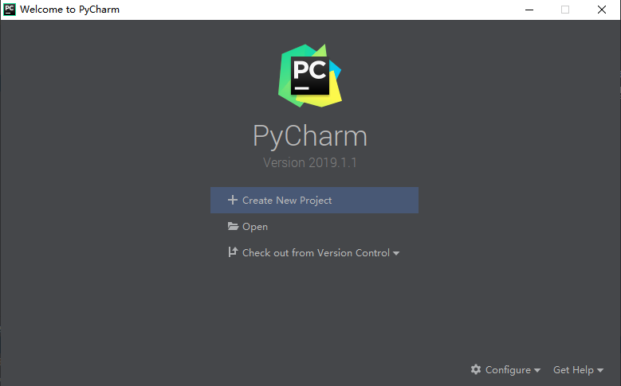
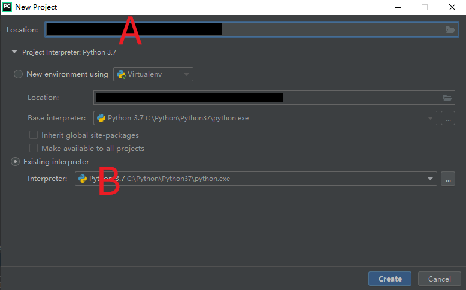
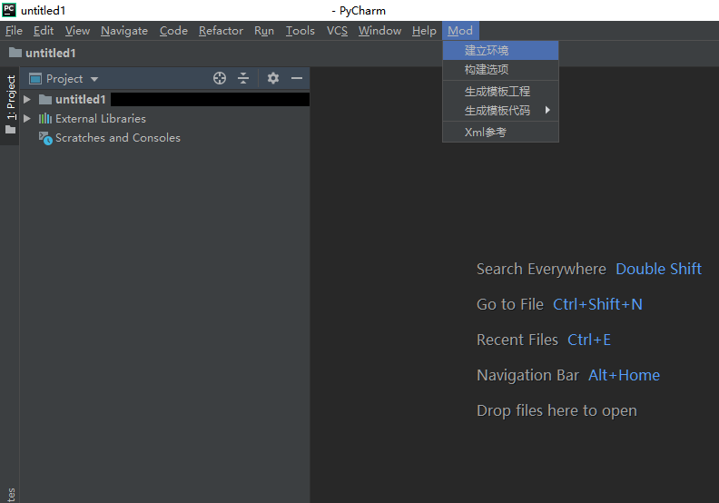
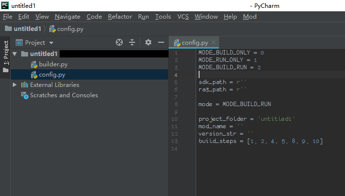
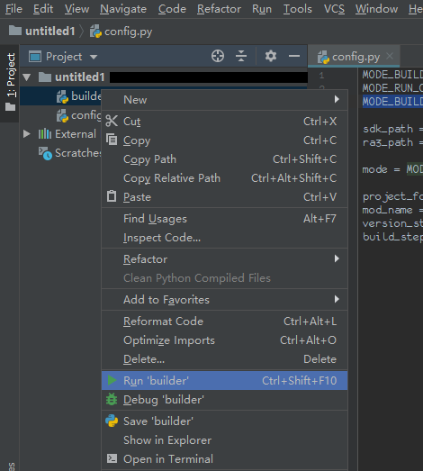

开始新的项目
-
在安装ride之后，打开Pycharm。
如果您是第一次使用，可以根自的喜好对Pycharm进行一些调整，
不会对ride产生影响。
  
* 当出现欢迎界面时，选择`Create New Project`

* 请在A处选择mod文件夹位置，**必须位于可用Mod SDK的mod文中**！
如`C:/RA3 MODSDK-X/Mods/mymod`。
文件夹可以不存在，Pycharm会自动创建。
* 请选择B处前的`Existing interpreter`, 
并在下拉列表中找到Python的安装位置
* 完成前两项后，请点击`Create`以创建工程

* 如果您能在菜单栏的末项看到Mod，说明RIDE安装成功
* 请点击`建立环境`以生成用于构建的Python脚本

* 请修改config.py以保证ride正常构建

变量 | 关于值的说明 | 将查找的文件/备注
---- | ---- | ----
sdk_path | Mod SDK路径 | msauto.exe
ra3_path | RedAlert3路径 | RA3.exe
mode | MODE_BUILD_ONLY | 仅构建
 -- | MODE_RUN_ONLY | 仅运行
 -- | MODE_BUILD_RUN | 构建并运行
 project_folder | 工程文件夹 | -- 
 version_str | 版本字符串 | --
 build_step | 参考Mod -> 构建选项 | --
 
 如何运行Mod?
 -
 
 
 * 对`builder.py`右键，并点击`Run 'builder'`